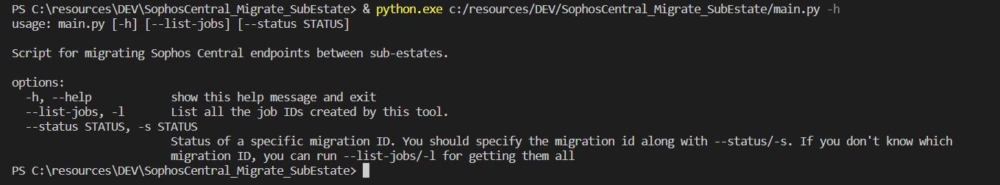

## O que é a Sophos Central Migration Tool?

Uma ferramenta criada para os usuários consumirem facilmente a API de migração Sophos: https://developer.sophos.com/docs/endpoint-v1/1/routes/migrations/get

## Como instalo o Sophos Central Migration Tool?

Certifique-se de ter pelo menos Python 3.8 e PIP (https://pypi.org/project/pip/) instalados.

Após baixar esta ferramenta, use pip para instalar dependências usando o seguinte comando:

`pip3 install -r requirements.txt`

## Como uso o Sophos Central Migration Tool?

Em primeiro lugar, renomeie o credenciais.ini.default para credenciais.ini.
Crie credenciais Client ID e Client SECRET para instâncias centrais de **origem** e **destino** e defina-as no arquivo credenciais.ini.

As chaves de credenciais devem ser criadas com direitos de "Super Administrador principal de serviço", caso contrário, você receberá uma mensagem "Proibido" como retorno.

Use esta documentação para saber como obter essas credenciais.

https://docs.sophos.com/central/Customer/help/en-us/central/Customer/tasks/ep_APICredentials.html

Habilite a migração no Sophos Central em Global Settings > Endpoint Migrations e defina uma data de expiração (recomendado).

Você pode então executar esta ferramenta.

Esta ferramenta contém as principais opções:

* *-h*: mostra a mensagem de ajuda
* *-l/--list-jobs*: lista todas tarefas criadas no Tenant de destino
* *-s/--status*: obtém o status de um ID de uma tarefa específica
* *-e/--endpoint-file*: Esta opção irá gerar uma lista de todos os endpoints na pasta "Jobs". Este arquivo json pode ser modificado para definir apenas os endpoints que devem ser migrados. Após editar este arquivo, você precisa executar o script novamente sem argumentos para criar um job com a nova lista de endpoints.

Se nenhuma dessas opções tiver sido passada na linha de comando, ele executará a migração em todos os endpoints no tenant de origem.

Depois disso, você poderá obter o status de cada migração de endpoint.

## Como fornecer feedback ou relatar bugs?

Você pode me enviar um e-mail para rafael (.) Foster at sophos (.) com.

Apreciá-lo!
